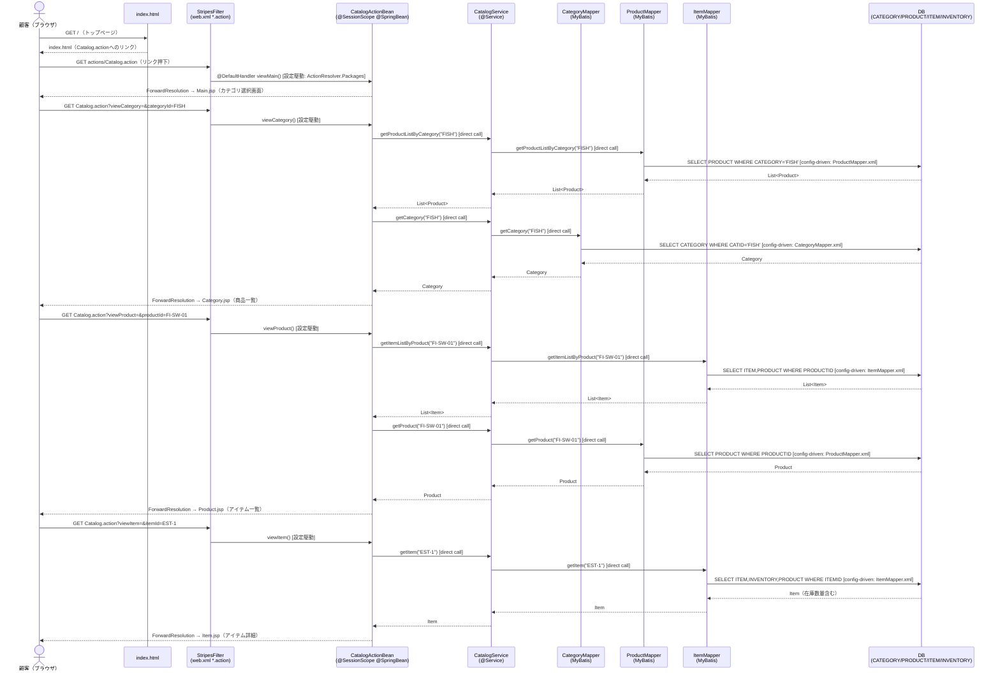

# FLOW-001 — 商品カタログ参照フロー

## 1. フロー概要（業務の言葉）

顧客がペットショップのトップページからサイトに入り、カテゴリ一覧→カテゴリ別商品一覧→商品アイテム一覧→アイテム詳細の順に商品を閲覧する一連の参照フロー。
途中どの画面でも「keyword」による商品検索も可能。すべて読み取り専用であり、DBへの書き込みは発生しない。

代表的な業務シナリオ:
- 顧客がトップページを開く → 「FISH」カテゴリを選択 → 「Angelfish」商品を選択 → アイテム「EST-1」の詳細を確認 → カートに追加（カートフローへ遷移）

---

## 2. Mermaid フロー図

---

## 3. ステップ表

| # | 層 | クラス・設定 | 業務内容 | 呼出種別 | evidence |
|---|----|-----------|---------|---------|----|
| 1 | UI | `src/main/webapp/index.html` | トップページ表示。`actions/Catalog.action`へのリンクを提供 | 静的HTML | `index.html:32 <a href="actions/Catalog.action">` |
| 2 | フレームワーク | `web.xml` StripesFilter + StripesDispatcher | `*.action`リクエストを受け取り、`ActionResolver.Packages=org.mybatis.jpetstore.web`でActionBeanクラスを解決 | config-driven | `web.xml:40-63` |
| 3 | Web層（入口） | `CatalogActionBean#viewMain()` `@DefaultHandler` | デフォルトハンドラとしてMain.jsp（カテゴリ選択画面）を返す | config-driven（@DefaultHandler） | `CatalogActionBean.java:143-146` |
| 4 | Web層（入口） | `CatalogActionBean#viewCategory()` | リクエストパラメータ`categoryId`を受け取り、カテゴリ別商品一覧取得処理を呼び出す | config-driven（Stripesイベント名） | `CatalogActionBean.java:153-159` |
| 5 | 業務ロジック | `CatalogService#getProductListByCategory(String)` | カテゴリIDに対応する商品一覧を取得するビジネスロジック | direct | `CatalogService.java:59-61` |
| 6 | DB アクセス | `ProductMapper#getProductListByCategory(String)` | MyBatisインターフェース呼出。XMLにバインド | direct | `ProductMapper.java:30` |
| 7 | DB アクセス設定 | `ProductMapper.xml` `<select id="getProductListByCategory">` | `SELECT PRODUCTID,NAME,DESCN,CATEGORY FROM PRODUCT WHERE CATEGORY=#{value}` を発行 | config-driven（MyBatisマッパーXML） | `ProductMapper.xml:36-44` |
| 8 | DB | `PRODUCT`テーブル | 商品マスタ参照（SELECT） | - | `ProductMapper.xml:36` |
| 9 | 業務ロジック | `CatalogService#getCategory(String)` | カテゴリ詳細情報を取得 | direct | `CatalogService.java:51-53` |
| 10 | DB アクセス設定 | `CategoryMapper.xml` `<select id="getCategory">` | `SELECT CATID,NAME,DESCN FROM CATEGORY WHERE CATID=#{categoryId}` を発行 | config-driven（MyBatisマッパーXML） | `CategoryMapper.xml:26-33` |
| 11 | DB | `CATEGORY`テーブル | カテゴリマスタ参照（SELECT） | - | `CategoryMapper.xml:26` |
| 12 | Web層（入口） | `CatalogActionBean#viewProduct()` | リクエストパラメータ`productId`を受け取り、アイテム一覧取得処理を呼び出す | config-driven（Stripesイベント名） | `CatalogActionBean.java:166-172` |
| 13 | 業務ロジック | `CatalogService#getItemListByProduct(String)` | 商品IDに対応するアイテム一覧取得 | direct | `CatalogService.java:79-81` |
| 14 | DB アクセス設定 | `ItemMapper.xml` `<select id="getItemListByProduct">` | `SELECT ITEM,PRODUCT WHERE PRODUCTID=#{value}` を発行（ITEM/PRODUCTのJOIN） | config-driven（MyBatisマッパーXML） | `ItemMapper.xml:26-45` |
| 15 | DB | `ITEM`テーブル、`PRODUCT`テーブル | アイテム・商品情報JOIN参照（SELECT） | - | `ItemMapper.xml:26` |
| 16 | Web層（入口） | `CatalogActionBean#viewItem()` | リクエストパラメータ`itemId`を受け取り、アイテム詳細を取得 | config-driven（Stripesイベント名） | `CatalogActionBean.java:179-183` |
| 17 | 業務ロジック | `CatalogService#getItem(String)` | アイテムID指定でアイテム詳細（在庫含む）を取得 | direct | `CatalogService.java:83-85` |
| 18 | DB アクセス設定 | `ItemMapper.xml` `<select id="getItem">` | `SELECT ITEM,INVENTORY,PRODUCT WHERE ITEMID=#{value}` を発行（3テーブルJOIN。在庫数量QTYも含む） | config-driven（MyBatisマッパーXML） | `ItemMapper.xml:47-68` |
| 19 | DB | `ITEM`テーブル、`INVENTORY`テーブル、`PRODUCT`テーブル | アイテム詳細・在庫・商品情報JOIN参照（SELECT） | - | `ItemMapper.xml:47` |
| 20 | UI | `Item.jsp` | アイテム詳細画面を返却。「カートへ追加」リンク（CartActionBean#addItemToCart）へ遷移 | config-driven（stripes:link） | `Item.jsp:58 stripes:link beanclass=CartActionBean event=addItemToCart` |

### 備考・確認事項

- `Product.jsp`（アイテム一覧画面）では `<jsp:useBean>` により `CatalogActionBean` を直接インスタンス化している古い記法が存在する。Stripesの管理下にあるSessionScopeオブジェクトと競合リスクがある（evidence: `Product.jsp:20`）。
- `Main.jsp`のimgmap内にハードコードされた相対URLがあり、コンテキストルート変更時に壊れる可能性がある（evidence: `Main.jsp:72-83`）。
- バッチ処理は存在しない（資産確認済み）。
