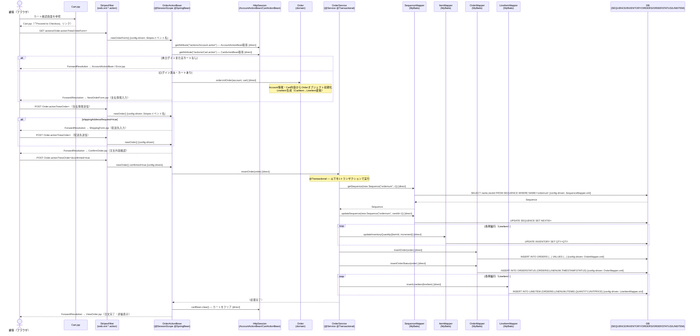

# FLOW-002 — 商品注文フロー

## 1. フロー概要（業務の言葉）

顧客がカートに商品を追加した後、注文手続きを行って注文を確定するまでの一連のオンラインフロー。
ログイン済み・カート内容あり、を前提条件として、支払い情報入力 → 配送先確認（必要な場合）→ 注文内容確認 → 注文確定 → 在庫減算・注文DB登録 → 注文完了画面、という流れをたどる。

代表的な業務シナリオ:
- ログイン済み顧客が Cart.jsp で「Proceed to Checkout」ボタンを押す
- 支払い情報（クレジットカード等）を NewOrderForm.jsp で入力
- 配送先が登録住所と異なる場合は ShippingForm.jsp で入力（任意）
- ConfirmOrder.jsp で注文内容を最終確認
- 「Confirm」ボタン押下で注文確定 → 在庫減算・注文/明細レコード挿入（@Transactional）
- ViewOrder.jsp で完了メッセージとともに注文詳細を表示

---

## 2. Mermaid フロー図

---

## 3. ステップ表

| # | 層 | クラス・設定 | 業務内容 | 呼出種別 | evidence |
|---|----|-----------|---------|---------|----|
| 1 | UI | `Cart.jsp` | カート確認画面。「Proceed to Checkout」= `stripes:link OrderActionBean event=newOrderForm` | config-driven（stripes:link） | `Cart.jsp:86 stripes:link OrderActionBean event=newOrderForm` |
| 2 | フレームワーク | `web.xml` StripesFilter + StripesDispatcher | `*.action`リクエストを受け取り、ActionBeanクラスを解決・Springでアノテーション付きフィールドにDI | config-driven | `web.xml:40-63` |
| 3 | Web層（入口） | `OrderActionBean#newOrderForm()` | セッションからAccountActionBean/CartActionBeanを取得し、ログイン・カート有無を確認。Order#initOrder()を呼び出して注文オブジェクトを初期化 | config-driven（Stripesイベント名） + direct（セッション参照） | `OrderActionBean.java:119-135` |
| 4 | ドメイン | `Order#initOrder(Account, Cart)` | Account情報（氏名・住所等）とCart内容（小計・CartItem一覧）からOrderオブジェクトを初期化。CartItem→LineItemへ変換 | direct | `Order.java:286-324` |
| 5 | UI | `NewOrderForm.jsp` | 支払い情報（クレジットカード種別・番号・有効期限）入力画面。`stripes:form beanclass=OrderActionBean event=newOrder` | config-driven（stripes:form） | `NewOrderForm.jsp:21` |
| 6 | Web層（入口） | `OrderActionBean#newOrder()` — 1回目 | `shippingAddressRequired`フラグを確認。trueならShippingForm.jspへ遷移、falseならConfirmOrder.jspへ遷移 | config-driven（Stripesイベント名） | `OrderActionBean.java:142-164` |
| 7 | UI（条件付き） | `ShippingForm.jsp` | 配送先住所入力画面（shippingAddressRequiredがtrueの場合のみ表示）。`stripes:form beanclass=OrderActionBean event=newOrder` | config-driven（stripes:form） | `ShippingForm.jsp:21` |
| 8 | UI | `ConfirmOrder.jsp` | 注文内容確認画面。「Confirm」リンクが`stripes:link OrderActionBean event=newOrder confirmed=true` | config-driven（stripes:link） | `ConfirmOrder.jsp:110 stripes:link OrderActionBean event=newOrder confirmed=true` |
| 9 | Web層（入口） | `OrderActionBean#newOrder()` — confirmed=true | `confirmed=true`かつOrderオブジェクトが存在する場合、OrderService#insertOrder()を呼び出して注文確定 | config-driven（Stripesイベント名） | `OrderActionBean.java:150-159` |
| 10 | 業務ロジック | `OrderService#insertOrder(Order)` `@Transactional` | 採番→在庫更新→注文挿入→注文ステータス挿入→明細挿入を1トランザクションで実行 | direct | `OrderService.java:59-77` |
| 11 | 業務ロジック | `OrderService#getNextId("ordernum")` | SEQUENCEテーブルから注文番号を採番し、次の番号に更新 | direct | `OrderService.java:121-130` |
| 12 | DB アクセス設定 | `SequenceMapper.xml` `<select id="getSequence">` | `SELECT name,nextid FROM SEQUENCE WHERE NAME=#{name}` | config-driven（MyBatisマッパーXML） | `SequenceMapper.xml:26-29` |
| 13 | DB | `SEQUENCE`テーブル | 注文番号採番用シーケンス参照（SELECT）・更新（UPDATE） | - | `SequenceMapper.xml:26,32` |
| 14 | DB アクセス設定 | `ItemMapper.xml` `<update id="updateInventoryQuantity">` | 明細行ごとに`UPDATE INVENTORY SET QTY=QTY-#{increment} WHERE ITEMID=#{itemId}` を発行 | config-driven（MyBatisマッパーXML） | `ItemMapper.xml:76-79` |
| 15 | DB | `INVENTORY`テーブル | 在庫数量を発注数分デクリメント（UPDATE） | - | `ItemMapper.xml:76` |
| 16 | DB アクセス設定 | `OrderMapper.xml` `<insert id="insertOrder">` | `INSERT INTO ORDERS (ORDERID,USERID,ORDERDATE,...)` を発行 | config-driven（MyBatisマッパーXML） | `OrderMapper.xml:93-101` |
| 17 | DB | `ORDERS`テーブル | 注文レコード挿入（INSERT） | - | `OrderMapper.xml:93` |
| 18 | DB アクセス設定 | `OrderMapper.xml` `<insert id="insertOrderStatus">` | `INSERT INTO ORDERSTATUS (ORDERID,LINENUM,TIMESTAMP,STATUS)` を発行 | config-driven（MyBatisマッパーXML） | `OrderMapper.xml:104-107` |
| 19 | DB | `ORDERSTATUS`テーブル | 注文ステータスレコード挿入（INSERT） | - | `OrderMapper.xml:104` |
| 20 | DB アクセス設定 | `LineItemMapper.xml` `<insert id="insertLineItem">` | 明細行ごとに`INSERT INTO LINEITEM (ORDERID,LINENUM,ITEMID,QUANTITY,UNITPRICE)` を発行 | config-driven（MyBatisマッパーXML） | `LineItemMapper.xml:37-40` |
| 21 | DB | `LINEITEM`テーブル | 注文明細レコード挿入（INSERT） | - | `LineItemMapper.xml:37` |
| 22 | Web層（入口） | `OrderActionBean#newOrder()` 後処理 | セッション上の`CartActionBean#clear()`を呼び出してカートをリセット | direct（セッション参照） | `OrderActionBean.java:154-155` |
| 23 | UI | `ViewOrder.jsp` | 注文完了・詳細表示画面。「Thank you, your order has been submitted.」メッセージ表示 | - | `OrderActionBean.java:157-159; ViewOrder.jsp` |

### 備考・確認事項

- セッション取得のキー: `OrderActionBean#newOrderForm()`はセッションキー`"/actions/Account.action"`でAccountActionBeanを取得（`OrderActionBean.java:109`）、`viewOrder()`では`"accountBean"`というキーで取得（`OrderActionBean.java:174`）。**同一セッションで2つの異なるキーを使用しているため、viewOrder()でnull参照が発生するリスクあり**。needs_confirm=yes。
- `Order#initOrder()`内でクレジットカード番号がハードコード固定値 `"999 9999 9999 9999"` になっている（`Order.java:311`）。実際の支払い処理は行われない。
- `@Transactional`でSpring Transactionが管理されているが、トランザクション分離レベル等の設定はデフォルト（DB依存）。移行時の動作確認が必要。
- バッチ処理は存在しない（資産確認済み）。
